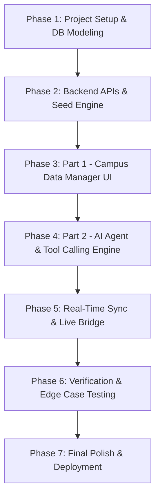

# CampusOS — My Step-by-Step Developer Approach

> **Author / Developer Blueprint**: How I will systematically approach, architect, build, and verify **CampusOS** to achieve a full 100/100 score + bonuses in the AI Build Hackathon.

---

## 🧭 My Understanding of the Problem

The core issue students face is fragmented campus information scattered across notices, chats, and spreadsheets. 
To solve this, I need to build **CampusOS** around two interconnected pillars:
1. **Part 1 — The Campus Data Manager**: A centralized, persistent backend and interactive dashboard managing 5 core campus data systems (Schedules, Rooms, Events, Announcements, Assignments) with full CRUD and special action workflows (room booking & event registration).
2. **Part 2 — The AI Agent**: An intelligent assistant using **real tool/function calling** that always queries the live backend state (never stale caches), handles multi-source queries, executes database mutations, clarifies vague prompts, and enforces guardrails.

---

## 🛠️ My Easiest, Zero-Friction Tech Stack Selection

To avoid setup headaches, database server configs, and native compilation errors (like `node-gyp` on Windows):

| Layer | Easiest Choice | Why It's the Easiest & Best for Hackathons |
| :--- | :--- | :--- |
| **All-in-One Framework** | **Next.js (App Router, TypeScript)** | **One single command (`npm run dev`)** runs both the UI and backend API routes. No need to run separate frontend and backend servers. |
| **Database / Storage** | **Persistent File-Backed JSON Database (`fs` / `db/`)** | **Zero installation, zero server setup, zero schema migrations.** Since seed data is already JSON (`data/*.json`) and contains nested arrays (`bookings: []`, `equipment: []`, `registrations: []`), a persistent JSON storage engine reads/writes seamlessly with 100% schema alignment and survives restarts/reloads. |
| **Styling & UI** | **TailwindCSS + Lucide Icons** | Fast, clean, modern UI with badges, modals, and responsive tables without writing custom CSS from scratch. |
| **AI Agent & LLM** | **OpenAI API (`gpt-4o-mini`) or Groq (`llama-3.3-70b`) or Gemini** | Reliable tool calling with minimal boilerplate code using official SDKs. |

> 💡 **Why this is 10x easier than traditional SQL for this hackathon**:
> The seed data has nested objects like `equipment: string[]`, `bookings: Booking[]`, and `registrations: Registration[]`. In SQL (SQLite/Postgres), you'd have to manage separate relational tables, foreign keys, or stringified columns. With a persistent JSON store (`fs` backed in a dedicated `server/db/` folder), it matches the seed schema **natively**, saves changes instantly to disk, persists across page reloads and app restarts, and requires **zero database installation or driver compilation**.

---

## 🪜 Part-by-Part Step-by-Step Approach

---

### 📍 PART 1: Building the Campus Data Manager (Backend & Dashboard)

My goal here is to ensure all 5 systems are fully functional, persistent, and react immediately to changes.

#### Step 1: Zero-Config Persistent Database & Seeding
1. Rather than fighting SQL migrations or native Windows build tools (`node-gyp`), I will implement a clean persistent file-based store in `lib/db.ts`:
   - On app startup, check if `storage/` exists. If not, create it and copy `data/*.json` into `storage/` as the initial live working state.
   - All mutations (Add, Edit, Delete, Room Booking, Event Registration) update `storage/*.json` immediately via `fs.writeFileSync`.
   - The original `data/*.json` seed files remain untouched (preserving the clean repo requirement).
   - This ensures **100% data persistence across page reloads and app restarts**, handles nested `bookings` and `registrations` out of the box with zero joins, and requires zero database drivers or external services.

2. I will write clean helper functions in `lib/db.ts`:
   - `getSchedules()`, `saveSchedules(data)`
   - `getRooms()`, `saveRooms(data)`
   - `getEvents()`, `saveEvents(data)`
   - `getAnnouncements()`, `saveAnnouncements(data)`
   - `getAssignments()`, `saveAssignments(data)`

#### Step 2: REST APIs & Business Logic
1. I will implement standard CRUD endpoints (`GET`, `POST`, `PUT/PATCH`, `DELETE`) for all 5 entities.
2. I will implement specialized business actions:
   - **Room Booking Engine**:
     - Check if the requested room exists.
     - Check for timetable conflicts against `schedules` for that day/time.
     - Check for ad-hoc booking conflicts against `bookings`.
     - Reject if overlapping, or save booking if free.
   - **Event Registration Engine**:
     - Verify event capacity (`registered < capacity`).
     - Check if student is already registered.
     - Increment `registered` count and save registration record.
   - **Cancellation Handlers**: Endpoints to cancel room bookings and unregister from events.

#### Step 3: Frontend Dashboard & Reactive UI
1. I will create a responsive, modern university dashboard with a tabbed/sidebar layout:
   - **Overview / Home**: Quick glance at today's classes, urgent announcements, and upcoming deadlines.
   - **Schedules Tab**: Weekly timetable filterable by day (Sunday–Thursday), course, and instructor.
   - **Rooms Tab**: Grid/List of rooms showing capacity, equipment badges, and current availability + "Book Room" modal.
   - **Events Tab**: Event cards showing seats remaining, date, venue, and "Register" button.
   - **Announcements Tab**: Notice board with priority tags (`high`, `medium`, `low`) and expiry indicator.
   - **Assignments Tab**: Deadline tracker with status tags (`pending`, `submitted`, `late`, `graded`).
2. I will ensure **Instant UI Reactivity**:
   - Adding, editing, or deleting a record updates the UI immediately (using optimistic state updates or query invalidation) without requiring manual page reloads.

---

### 🤖 PART 2: Engineering the AI Agent (Tool Calling & Intelligence)

My goal here is to build an agent that behaves like a knowledgeable senior student who reads live data and never guesses.

#### Step 4: System Prompt Architecture & Context
1. I will configure the system prompt with key campus rules:
   - Current academic calendar context (Sunday to Thursday week, Friday/Saturday weekend).
   - 24-hour time conventions (`HH:MM`) and ISO date formatting (`YYYY-MM-DD`).
   - Instruction: *"Always call the provided tools to query or update data. Never invent or assume schedule details."*
2. I will build guardrail rules into the agent prompt:
   - **Ambiguity Detection**: If the user makes a vague request (e.g. *"Book me a room tomorrow afternoon"*), the agent must ask for the exact time, room number, or capacity before calling any booking tool.
   - **Safety & Authorization**: If the user asks to modify grades, delete system logs, or do unauthorized actions, the agent will politely refuse.

#### Step 5: Tool (Function Calling) Implementation
I will create explicit tool definitions with JSON schema parameters for the LLM:
1. `get_schedules({ day, course, instructor, room })` — Queries class timetables.
2. `get_rooms({ min_capacity, equipment, date, start_time, end_time, type })` — Filters available rooms by equipment, size, and free time slots.
3. `book_room({ room_number, date, start_time, end_time, booked_by, purpose })` — Executes the booking logic with conflict prevention.
4. `cancel_booking({ booking_id })` — Cancels an existing booking.
5. `get_events({ date, status, upcoming_only })` — Fetches campus events.
6. `register_event({ event_id, student_id, student_name })` — Registers student if seats are available.
7. `get_announcements({ priority, active_only })` — Retrieves latest active announcements.
8. `get_assignments({ status, due_before, course })` — Returns upcoming deadlines and assignment status.
9. `find_free_time_activities({ day, until_time })` — Compound tool / helper to inspect schedules and suggest available events during free gaps.

#### Step 6: Tool Execution Loop & Multi-Source Reasoning
1. When a user sends a prompt:
   - The LLM receives the prompt and decides which tool(s) to call.
   - My backend executes the tool against the live database.
   - The result is fed back into the LLM context.
   - The LLM crafts a natural, helpful response citing specific live data.
2. Multi-source handling:
   - For *"I'm free until 2 PM — is there anything on campus I could drop into?"*, the agent will call `get_schedules` to find when the user's next class starts, then call `get_events` to find matching events occurring in that window.

---

### 🔄 PART 3: Real-Time Synchronization & Live State Guarantee

Judges will edit data in the dashboard and immediately ask the agent about it.

#### Step 7: Bridging the Live Data
1. **Zero Memory Caching**: The agent tools will query the database directly on every invocation.
2. **Instant Consistency**: When a user changes an announcement from *"CSE321 class cancelled"* to *"CSE321 moved to Room 304 at 2:00 PM"*, the agent's next query to `get_announcements` or `get_schedules` will instantly see the updated record.
3. **Action Sync**: When the agent books a room or registers for an event via chat, the UI dashboard will reactively reflect the new booking/registration count.

---

### 🧪 PART 4: Verification Against Judge Evaluation Criteria

I will rigorously test every query from [`sample_queries/sample_queries.md`](./sample_queries/sample_queries.md):

#### 1. Simple Lookups
- [ ] *"When is my next class?"* -> Agent inspects schedule for today/upcoming day.
- [ ] *"What classes do I have on Wednesday?"* -> Agent filters schedule for `day == "Wednesday"`.
- [ ] *"What assignments do I have due this week?"* -> Agent filters assignments with deadlines in the current week.
- [ ] *"Show me all high priority announcements."* -> Agent filters announcements with `priority == "high"`.

#### 2. Multi-Source Reasoning
- [ ] *"I'm free until 2 PM — is there anything on campus I could drop into?"* -> Cross-references schedule free periods with ongoing/upcoming events.
- [ ] *"Which labs have a projector and can fit at least 30 people?"* -> Filters rooms where `type == "lab"`, `equipment.includes("projector")`, `capacity >= 30`.

#### 3. Actions & Mutations
- [ ] *"Book Room 7A02 tomorrow from 3 PM to 5 PM."* -> Validates no conflict -> creates booking -> confirms with booking ID.
- [ ] *"Register me for the Guest Lecture on Deep Learning."* -> Finds event -> verifies capacity -> registers student -> confirms seat.
- [ ] *"I need a room for 5 people with a projector, tomorrow between 2 and 4."* -> Finds matching available room -> asks or proceeds to book.

#### 4. Ambiguity, Edge Cases & Guardrails
- [ ] *"Just book me any room tomorrow afternoon."* -> Agent detects missing details (time, purpose, room type) and asks clarifying questions.
- [ ] Attempting to book during an existing class -> Agent detects timetable conflict and refuses with alternative suggestions.
- [ ] Asking to register for a full/cancelled event -> Agent informs the user that registrations are closed.

#### 5. Live Dashboard Mutation Test (Evaluation Scenario)
- [ ] Modify a schedule/announcement on the UI -> immediately ask the agent in chat -> confirm the agent gives the updated answer.

---

### 📦 PART 5: Final Polish, Documentation & Submission

#### Step 8: Documentation & Setup Experience
1. **`README.md`**:
   - Concise project overview and architecture summary.
   - Explicit step-by-step local setup commands (`npm install`, `npm run dev` or Python equivalent).
   - Clear documentation of environment variables (`.env.example`).
   - Sample prompt chips/guide for evaluators.
2. **`SUBMISSION.md` Checklist**:
   - Ensure repository is set to **Public** before **8:30 PM, 4 September**.
   - Verify no secrets/API keys are committed.
   - (Bonus) Deploy a live version on Vercel / Render / Railway and add the live URL.

---

## 🎯 Summary Checklist

- [x] Clear roadmap established from data layer to UI and AI agent.
- [x] Full CRUD and persistence guaranteed across all 5 datasets.
- [x] Real function calling with conflict checks and multi-source reasoning.
- [x] Ambiguity clarification and safety guardrails integrated.
- [x] Step-by-step test plan matched directly against judging sample queries.
